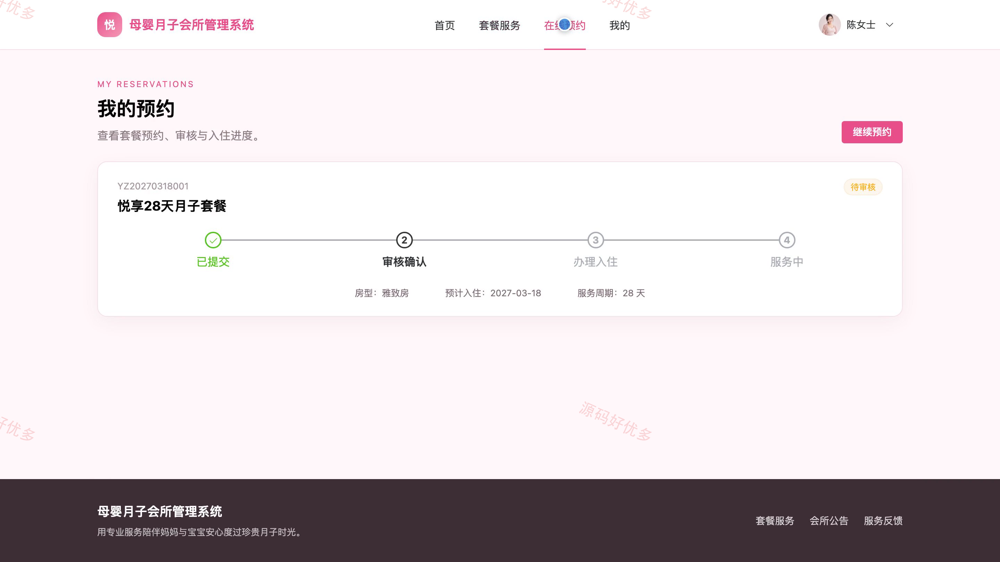
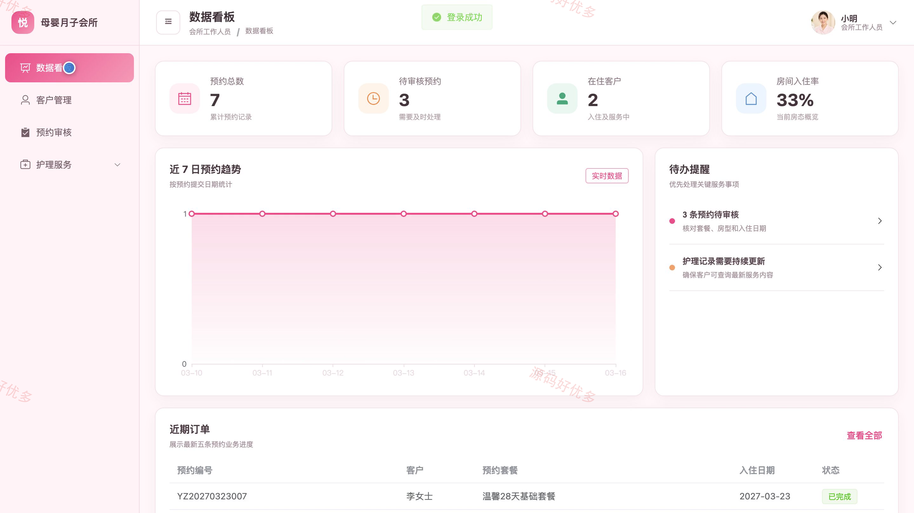
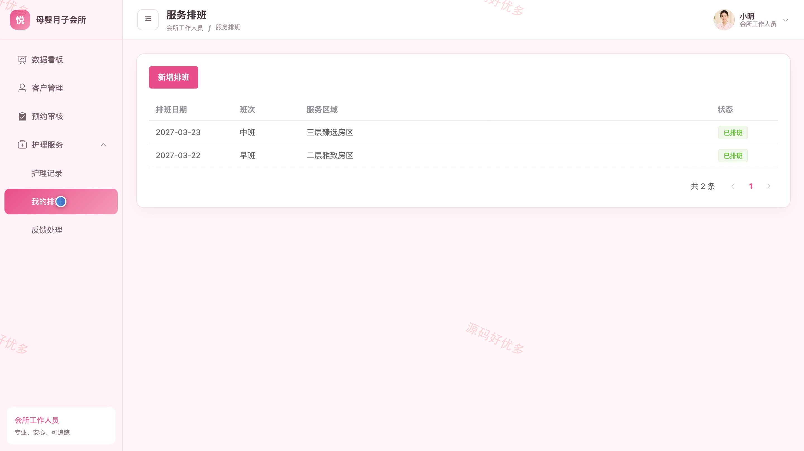
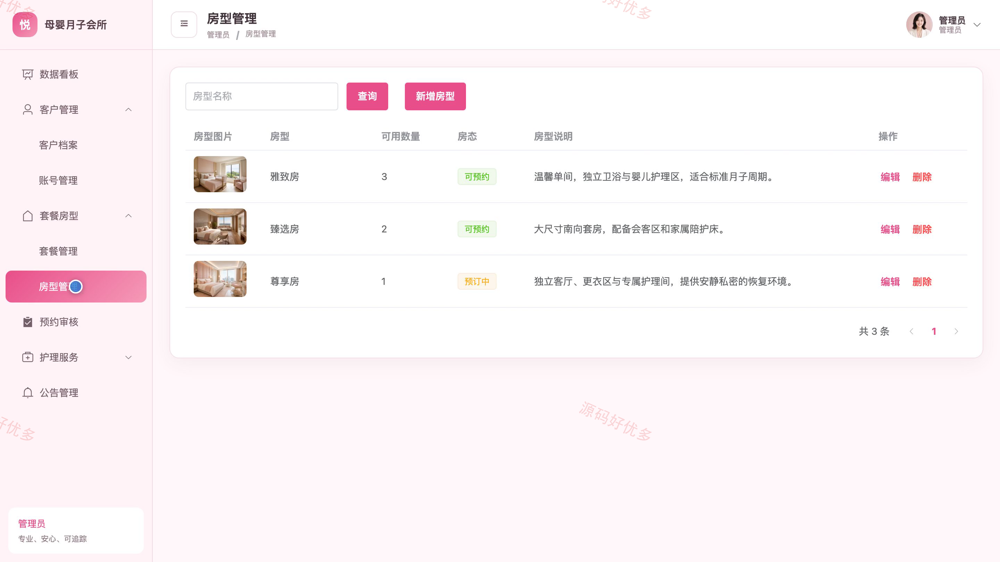
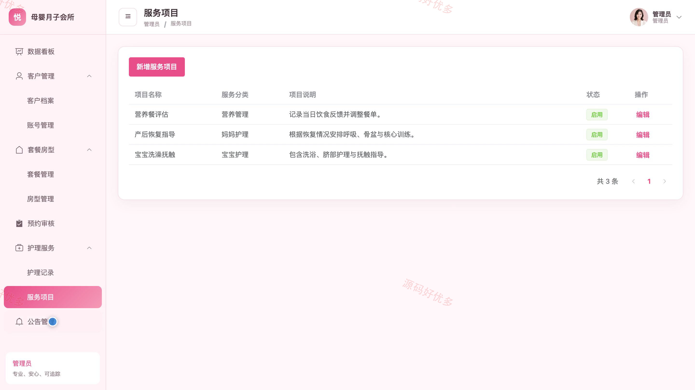

# bs057A
bs057A母婴月子会所管理系统
## 源码问题查看主页咨询

### 一、关键词
月子会所、月子中心、母婴护理、入住预约、产后照护

### 二、作品包含
源码+数据库+全套环境和工具资源+本地部署教程

### 三、项目技术
前端技术： Html、Css、Js、Vue3.4、Element-Plus
后端技术：Java、SpringBoot3.2.0、MyBatis-Plus

### 四、运行环境（以下版本亲测，其他版本兼容性请自行测试）
开发工具：IDEA/eclipse + VSCODE

数据库：MySQL5.7+（共12张表）

数据库管理工具：Navicat10以上版本

环境配置软件： JDK17 + Maven3.6.3

前端Nodejs：20.20.2

浏览器：谷歌浏览器

### 五、项目介绍
项目编号：bs057A

本系统面向母婴月子会所的客户服务与日常运营，客户可浏览套餐和公告、提交入住预约、查看护理记录并反馈服务；会所工作人员可维护客户档案、审核预约、登记护理记录、查看排班并处理反馈；管理员负责账号、套餐、房型、服务项目、公告和运营数据管理。

角色：客户、会所工作人员、管理员

客户功能：套餐与房型浏览、会所公告查看、入住预约提交与查询、护理记录查看、服务反馈、个人档案管理、密码修改。

会所工作人员功能：数据看板、客户档案管理、预约审核与入住办理、护理记录管理、服务排班查看、客户反馈处理、个人中心。

管理员功能：数据看板、账号与客户档案管理、套餐与房型管理、预约审核、护理记录管理、服务项目管理、公告管理、个人中心。

### 六、运行截图

